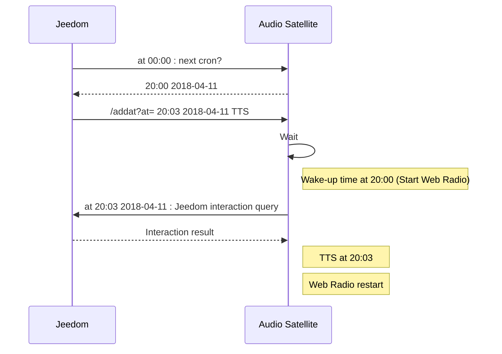

# Home automation Audio Satellite API Documentation

- [Manage global volume](https://github.com/diving91/web-radio/blob/master/doc/api.md#manage-global-volume)
- [Manage Web Radio](https://github.com/diving91/web-radio/blob/master/doc/api.md#manage-web-radio)
- [Manage Text-to-speech (TTS)](https://github.com/diving91/web-radio/blob/master/doc/api.md#manage-text-to-speech-tts)
- [Manage alarm clock scheduler (recurring)](https://github.com/diving91/web-radio/blob/master/doc/api.md#manage-alarm-clock-scheduler-recurring)
- [Manage alarm clock scheduler (non recurring)](https://github.com/diving91/web-radio/blob/master/doc/api.md#manage-alarm-clock-scheduler-non-recurring)
- [Manage Web Radio Playlist](https://github.com/diving91/web-radio/blob/master/doc/api.md#manage-web-radio-playlist)

# Embedded app
|Description|Local application|
|--|--|
|**URL**|**/**|
|Method|GET |
|URL params|None|
|Success|Render server hosted application|
|Error|none|

# Manage global volume
|Description|Set current audio volume (1-100)|
|--|--|
|**URL**|**/setvol/@id**|
|Method|GET |
|URL params|none|
|Success|{"Status":"OK","Volume":"24"}|
|Error|{"Status":"KO","Volume":"Out of Range"}|
|Note|Volume is set permanent even after a shutdown/reboot|
|Example|/setvol/50|

## 

|Description|Get current audio volume (1-100)|
|--|--|
|**URL**|**/getvol**|
|Method|GET |
|URL params|none|
|Success|{"Status":"OK","Volume":"24"}|
|Error|none|

# Manage Web Radio

|Description|Turn Web Radio ON|
|--|--|
|**URL**|**/radion**|
|Method|GET |
|URL params|none|
|Success|{"Status":"OK","Radio":"Running","path":"http:\/\/stream_url.mp3"}|
||{"Status":"OK","Radio":"Was already Running"}|
|Error|none|
|Note|Stream the Selected Radio in Playlist|
||If no playlist, stream default Radio (server side configured)|
||If radio stream is not reachable, plays a local file (server side configured)|

##

|Description|Turn Web Radio OFF|
|--|--|
|**URL**|**/radioff**|
|Method|GET |
|URL params|none|
|Success|{"Status":"OK","Radio":"Stopped"}|
|Error|none|
|Note|It also turns off running TTS stream|

##
|Description|Snooze Web Radio|
|--|--|
|**URL**|**/snooze**|
|Method|GET |
|URL params|none|
|Success|{"Status":"OK","Snooze at":"HH:MM YYYY-MM-DD"}|
|Error|{"Status":"KO","Snooze at":"Radio was not running"}|
|Note|Snooze time is server side configured|

##

|Description|Return Web Radio status|
|--|--|
|**URL**|**/radiostate**|
|Method|GET |
|URL params|none|
|Success|{"Status":"OK","Radio":"Running"}|
||{"Status":"OK","Radio":"Stopped"}|
|Error|none|

##

|Description|Toggle Web Radio ON/OFF|
|--|--|
|**URL**|**/radiotoggle**|
|Method|GET |
|URL params|none|
|Success|{"Status":"OK","Radio":"Running"}|
||{"Status":"OK","Radio":"Stopped"}|
|Error|none|

## Manage Text-to-speech (TTS)

|Description|Play a Text-to-Speed voice (VoiceRSS or picoTTS)|
|--|--|
|**URL**|**/tts/@say**|
|Method|GET |
|URL params|none|
|Success|{"Status":"OK"}|
|Error|{"Status":"TTS: #Error info from VoiceRSS#"}|
|Example|/tts/Hello%20World!|
|Note| TTS engine is server side configured|
||picoTTS does not required web service, it runs locally|
||TTS play volume is server side configured|
||If a Web Radio was running, it is stopped for TTS, then restarted automatically|

##

|Description|Play a preconfigured weather information|
|--|--|
|**URL**|**/weather**|
|Method|GET |
|URL params|none|
|Success|{"Status":"OK"}|
|Error|{"Status":"TTS: #Error date from VoiceRSS#"}|
|Note|Use a web service from https://www.prevision-meteo.ch|
||Actual temperature, min/max temperature for today|
|| Actual weather condition, Today weather condition|

##

|Description|Play an interaction result from Jeedom home automation system|
|--|--|
|**URL**|**/jeedom**|
|Method|GET |
|URL params|none|
|Success|{"Status":"OK"}|
|Error|{"Status":"TTS: #Error date from VoiceRSS#"}|
|Note|Uses Interaction system of http://jeedom.fr|
||calls jeedom API with a server side predefined query and play back result using TTS|
||This can be used with a non recurring alarm clock trigger|
||Typical use case: Jeedom query (**/nextcron**) the next wake up time every day at 00:00 and set (**/addat**) a non recurring wake-up time at  Web Radio wake up time +xx minutes to render interaction result|
 

## Manage alarm clock scheduler (recurring)
|Description|Return the list of alarm clock events|
|--|--|
|**URL**|**/getcron**|
|Method|GET |
|URL params|none|
|Success|{"Status":"OK","cron":[{"raw":"30 06 * * 1,2,3,4,5","active":true,"mm":"30","hh":"06","dd":"1,2,3,4,5","name":"Semaine"},{"raw":"50 07 * * 6","active":true,"mm":"50","hh":"07","dd":"6","name":"Samedi 1"},{"raw":"#50 08 * * 6","active":false,"mm":"50","hh":"08","dd":"6","name":"Samedi 2"},{"raw":"50 08 * * 0","active":true,"mm":"50","hh":"08","dd":"0","name":"Dimanche"},{"raw":"#50 4 * * 5","active":false,"mm":"50","hh":"4","dd":"5","name":"Venlo"}]}|
|Error|{"Status":"KO"}|
|Note|The returned Json uses cron notation to describe alarm clock events|
||"mm hh * * dow" (dow=day of week: 0..7 winth Sunday =0)|
||"active": true\|false tells if the alarm clock event is activated or not|
||More than one alarm clock event can be activate at a time|
##

|Description|Add a recurring alarm clock event|
|--|--|
|**URL**|**/addcron**|
|Method|GET |
|URL params|cron=json to describe the alarm clock event|
|Success||
|Error||
|Example|[http://myip/addcron?cron={"t":"23:10","d":[true,true,true,true,false,true,true],"c":"test event"}]()
|

##

|Description|Delete a recurring alarm clock event|
|--|--|
|**URL**|**/delcron/@id**|
|Method|GET |
|URL params|none|
|Example|/delcron/1|

##

|Description|Activate / Desactive a recurring alarm clock event|
|--|--|
|**URL**|**/stacron/@id/@state**|
|Method|GET |
|URL params|none|
|Example|/stacron/1/on|
||/stacron/2/off|

##

|Description|Return the next alarm clock time and date|
|--|--|
|**URL**|**/nextcron**|
|Method|GET |
|URL params|none|

GET /getcron
GET /addcron
GET /delcron/@id:[0-9][0-9]*
GET /stacron/@id:[0-9][0-9]*/@state:on|off
GET /nextcron

## Manage alarm clock scheduler (non recurring)
GET /getat
GET /addat
GET /delat/@id:[1-9][0-9]*

addat?at={%22d%22:1523823600,%22t%22:%22tts%22}
addat?at={"d":1523823600,"t":"tts"}

## Manage Web Radio Playlist 
GET /getstation
GET /selstation/@id:[0-9][0-9]*
POST /upload
GET /download

