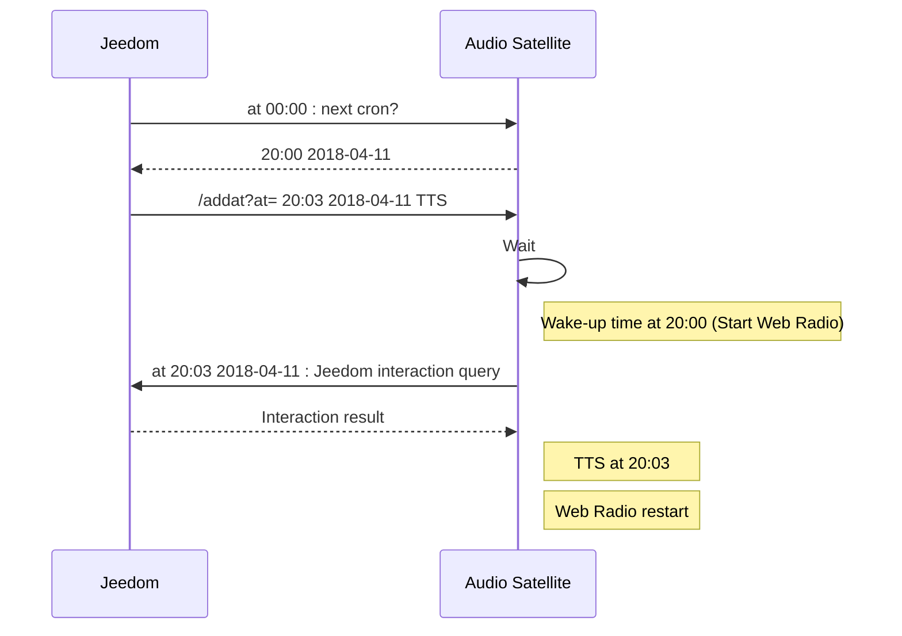

# Home automation Audio Satellite API Documentation

- [Manage global volume](https://github.com/diving91/web-radio/blob/master/doc/api.md#manage-global-volume)
	+ **/setvol/@id**
	+ **/getvol**
- [Manage Web Radio](https://github.com/diving91/web-radio/blob/master/doc/api.md#manage-web-radio)
	+ **/radion**
	+ **/radioff**
	+ **/snooze**
	+ **/radiostate**
	+ **/radiotoggle**
- [Manage Text-to-speech (TTS)](https://github.com/diving91/web-radio/blob/master/doc/api.md#manage-text-to-speech-tts)
	+ **/tts/@say**
	+ **/weather**
	+ **/jeedom**
- [Manage alarm clock scheduler (recurring)](https://github.com/diving91/web-radio/blob/master/doc/api.md#manage-alarm-clock-scheduler-recurring)
	+ **/getcron**
	+ **/addcron**
	+ **/delcron/@id**
	+ **/stacron/@id/@state**
	+ **/nextcron**
- [Manage alarm clock scheduler (non recurring)](https://github.com/diving91/web-radio/blob/master/doc/api.md#manage-alarm-clock-scheduler-non-recurring)
	+ **/getat**
	+ **/addat**
	+ **/delat/@id**
- [Manage Web Radio Playlist](https://github.com/diving91/web-radio/blob/master/doc/api.md#manage-web-radio-playlist)
	+ **/getstation**
	+ **/selstation/@id**
	+ **/upload**
	+ **/download**

# Embedded app
|Description|Local application|
|--|--|
|**URL**|**/**|
|Method|GET |
|URL params|None|
|Success|Render server hosted application|
|Error|none|

# Manage global volume
|Description|Set current audio volume (1-100)|
|--|--|
|**URL**|**/setvol/@id**|
|Method|GET |
|URL params|none|
|Success|{"Status":"OK","Volume":"24"}|
|Error|{"Status":"KO","Volume":"Out of Range"}|
|Note|Volume is set permanent even after a shutdown/reboot|
|Example|/setvol/50|

## 

|Description|Get current audio volume (1-100)|
|--|--|
|**URL**|**/getvol**|
|Method|GET |
|URL params|none|
|Success|{"Status":"OK","Volume":"24"}|
|Error|none|

# Manage Web Radio

|Description|Turn Web Radio ON|
|--|--|
|**URL**|**/radion**|
|Method|GET |
|URL params|none|
|Success|{"Status":"OK","Radio":"Running","path":"http:\/\/stream_url.mp3"}|
||{"Status":"OK","Radio":"Was already Running"}|
|Error|none|
|Note|Stream the Selected Radio in Playlist|
||If no playlist, stream default Radio (server side configured)|
||If radio stream is not reachable, plays a local file (server side configured)|

##

|Description|Turn Web Radio OFF|
|--|--|
|**URL**|**/radioff**|
|Method|GET |
|URL params|none|
|Success|{"Status":"OK","Radio":"Stopped"}|
|Error|none|
|Note|It also turns off running TTS stream|

##
|Description|Snooze Web Radio|
|--|--|
|**URL**|**/snooze**|
|Method|GET |
|URL params|none|
|Success|{"Status":"OK","Snooze at":"HH:MM YYYY-MM-DD"}|
|Error|{"Status":"KO","Snooze at":"Radio was not running"}|
|Note|Snooze time is server side configured|

##

|Description|Return Web Radio status|
|--|--|
|**URL**|**/radiostate**|
|Method|GET |
|URL params|none|
|Success|{"Status":"OK","Radio":"Running"}|
||{"Status":"OK","Radio":"Stopped"}|
|Error|none|

##

|Description|Toggle Web Radio ON/OFF|
|--|--|
|**URL**|**/radiotoggle**|
|Method|GET |
|URL params|none|
|Success|{"Status":"OK","Radio":"Running"}|
||{"Status":"OK","Radio":"Stopped"}|
|Error|none|

## Manage Text-to-speech (TTS)

|Description|Play a Text-to-Speed voice (VoiceRSS or picoTTS)|
|--|--|
|**URL**|**/tts/@say**|
|Method|GET |
|URL params|none|
|Success|{"Status":"OK"}|
|Error|{"Status":"TTS: #Error info from VoiceRSS#"}|
|Example|/tts/Hello%20World!|
|Note| TTS engine is server side configured|
||picoTTS does not required web service, it runs locally|
||TTS play volume is server side configured|
||If a Web Radio was running, it is stopped for TTS, then restarted automatically|

##

|Description|Play a preconfigured weather information|
|--|--|
|**URL**|**/weather**|
|Method|GET |
|URL params|none|
|Success|{"Status":"OK"}|
|Error|{"Status":"TTS: #Error date from VoiceRSS#"}|
|Note|Use a web service from https://www.prevision-meteo.ch|
||Actual temperature, min/max temperature for today|
|| Actual weather condition, Today weather condition|

##

|Description|Play an interaction result from Jeedom home automation system|
|--|--|
|**URL**|**/jeedom**|
|Method|GET |
|URL params|none|
|Success|{"Status":"OK"}|
|Error|{"Status":"TTS: #Error date from VoiceRSS#"}|
|Note|Uses Interaction system of http://jeedom.fr|
||calls jeedom API with a server side predefined query and play back result using TTS|
||This can be used with a non recurring alarm clock trigger|
||Typical use case: Jeedom query (**/nextcron**) the next wake up time every day at 00:00 and set (**/addat**) a non recurring wake-up time at  Web Radio wake up time +xx minutes to render interaction result|
<br>




## Manage alarm clock scheduler (recurring)
Recurring alarm clock events are triggered at a defined time on specified days every week

|Description|Return the list of alarm clock events|
|--|--|
|**URL**|**/getcron**|
|Method|GET |
|URL params|none|
|Success|{"Status":"OK","cron":[{"raw":"30 06 * * 1,2,3,4,5","active":true,"mm":"30","hh":"06","dd":"1,2,3,4,5","name":"Semaine"},{"raw":"50 07 * * 6","active":true,"mm":"50","hh":"07","dd":"6","name":"Samedi 1"},{"raw":"#50 08 * * 6","active":false,"mm":"50","hh":"08","dd":"6","name":"Samedi 2"},{"raw":"50 08 * * 0","active":true,"mm":"50","hh":"08","dd":"0","name":"Dimanche"},{"raw":"#50 4 * * 5","active":false,"mm":"50","hh":"4","dd":"5","name":"Venlo"}]}|
|Error|{"Status":"KO"}|
|Note|The returned Json uses cron notation to describe alarm clock events|
||"mm hh * * dow" (dow=day of week: 0..7 with Sunday =0)|
||"active": true\|false tells if the alarm clock event is activated or not|
||More than one alarm clock event can be activate at a time|
##

|Description|Add a recurring alarm clock event|
|--|--|
|**URL**|**/addcron**|
|Method|GET |
|URL params|?cron=json to describe the alarm clock event|
|Success|TODO|
|Error|none|
|Example|[http://myip/addcron?cron={"t":"23:10","d":\[true,true,true,true,false,true,true\],"c":"noThursdays"}](http://myip/addcron?cron={"t":"23:10","d":\[true,true,true,true,false,true,true\],"c":"noThursdays"})|
|Note|When added, the alarm clock event is activated. You can use **/stacron** to desactivate|
||t: is the time format hh:mm|
||d: is an array to specify on which days the alarm clock will run. The array starts on [sunday, monday,..., saturday]|
||c: is a nickname for the alarm clock event|

##

|Description|Delete a recurring alarm clock event|
|--|--|
|**URL**|**/delcron/@id**|
|Method|GET |
|URL params|none|
|Success|{"Status":"OK","Cron":"2"}|
|Error|{"Status":"KO","Cron":"78 Not Found"}|
|Example|/delcron/2|
|Note|@id is the event id to delete and starts at 0 in the **/getcron** list|

##

|Description|Activate / Desactive a recurring alarm clock event|
|--|--|
|**URL**|**/stacron/@id/@state**|
|Method|GET |
|URL params|none|
|Success|{"Status":"OK","Cron":"4","State":"on"}|
|Success|{"Status":"OK","Cron":"4","State":"off"}|
|Error|{"Status":"KO","Cron":"78 Not Found"}|
|Example|/stacron/1/on|
||/stacron/2/off|
|Note|@id is the event id to activate/desactive and starts at 0 in the **/getcron** list|
|Note|@state = on\|off|

##

|Description|Return the next alarm clock event day, date and time|
|--|--|
|**URL**|**/nextcron**|
|Method|GET |
|URL params|none|
|Success|{"Status":"OK","Time":"Mardi 17\/04\/2018 06:30"}|
|Error|{“Status”:“KO”,“Time”:“Not Found”}|
|Note|Return an error state when all alarm clock events are deactivated, or no alarm clock is defined|

## Manage alarm clock scheduler (non recurring)
Non recurring alarm clock events are triggered only once at a defined date and time

|Description|Return the list of non recurring alarm clock events|
|--|--|
|**URL**|**/getat**|
|Method|GET |
|URL params|none|
|Success|{"Status":"OK","At":[{"id":"66","date":"Mercredi 25\/04\/2018 22:41","ts":1524688860,"type":"A"},{"id":"67","date":"Vendredi 27\/04\/2018 12:20","ts":1524824400,"type":"B"},{"id":"68","date":"Dimanche 29\/04\/2018 15:40","ts":1525009200,"type":"C"}]}|
|Error|{“Status”:“KO”,“At”:“Not Found”}|
|Note|"id" is the id to use to delete (**/delat**) a non recurring alarm clock event|
||"date" is the alarm clock event in clear text|
||"ts" is the alarm clock event in Unix timestamp format|
||"type" is the alarm clock event type "A"= Radio_on, "B" = Radio_off, "C"=Text-to-Speech (i.e. call Jeedom interaction)|

##

|Description|Define (add) a non recurring alarm clock event|
|--|--|
|**URL**|**/addat**|
|Method|GET |
|URL params|at={"d":timestamp,"t":"tts"}|
|Success|{"Status":"OK","At":"22:20 2018-04-15","Type":"tts"}|
|Error|none|
|Example|/addat?at={%22d%22:1523823600,%22t%22:%22tts%22}|
|Note|"d" is the Unix time stamp at which the alarm clock will be triggered|
||if the timestamp is <= current time stamp, the event is omitted|
||"t" is the type of event "on"\|"off"\|"tts"|

##

|Description|Delete a non recurring alarm clock event|
|--|--|
|**URL**|**/delat/@id**|
|Method|GET |
|URL params|none|
|Success|{"Status":"OK","At":"66 Deleted"}|
|Error|{“Status”:“KO”,“At”:“Not Found”}|
|Example|/delat/66|

## Manage Web Radio Playlist 

|Description|Returns the list of Web radio in the playlist|
|--|--|
|**URL**|**/getstation**|
|Method|GET |
|URL params|none|
|Success|{"Status":"OK","station":[{"URL":"http:\/\/stream1.chantefrance.com\/stream_chante_france.mp3 ","name":"Chante France","selected":"1"},{"URL":"http:\/\/cdn.nrjaudio.fm\/audio1\/fr\/30001\/mp3_128.mp3?origine=fluxradios ","name":"NRJ","selected":"0"}]}|
|Error|{“Status”:“KO”,“station”:“Not Found”}|
|Note|"URL" is the url of the web Radio stream|
||"name" is the nickname of the Web Radio|
||"selected" = 1 for the active Web radio in the the playlist (=0 for other Web Radio)|

##

|Description|Select a Web Radio in the Playlist|
|--|--|
|**URL**|**/selstation/@id**|
|Method|GET |
|URL params|none|
|Success|{“Status”:“OK”,“Station”:“2”}|
|Error|{“Status”:“KO”,“station”:“Not Found”}|
|Example|/selstation/2|

##

|Description|Upload a text file describing the Web Radio Playlist|
|--|--|
|**URL**|**/upload**|
|Method|POST|
|URL params|none|
|POST datas||
|Success|{"Status":"OK","file":"station.txt"}|
|Error|{"Status":"OK","file":"#Error type#"}|
Playlist text file is an ASCII text file as example:
```
1 http://stream1.chantefrance.com/stream_chante_france.mp3 #Chante France
0 http://cdn.nrjaudio.fm/audio1/fr/30001/mp3_128.mp3?origine=fluxradios #NRJ
0 http://cdn.nrjaudio.fm/audio1/fr/30601/mp3_128.mp3?origine=fluxradios #Nostalgie
0 http://cdn.nrjaudio.fm/audio1/fr/30201/mp3_128.mp3?origine=fluxradios #Cherie FM
0 http://roo8ohho.cdn.dvmr.fr/live/franceinfo-midfi.mp3?ID=f9fbk29m84 #France Info
0 http://icepe2.infomaniak.ch/impactfm-128.mp3 #Impact FM
0 http://radioclassique.ice.infomaniak.ch/radioclassique-high.mp3 #Radio Classique
```

##

|Description|Download a text file describing the Web Radio Playlist|
|--|--|
|**URL**|**/download**|
|Method|GET |
|URL params|none|
|Success|Will open a dialog to download a text file **station.txt**|
|Error|none|


